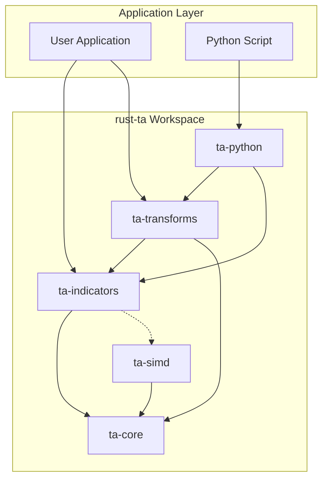
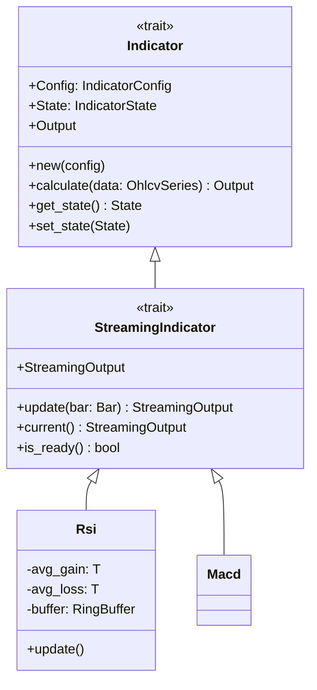
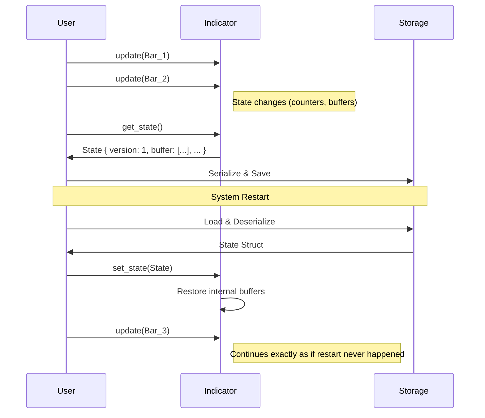
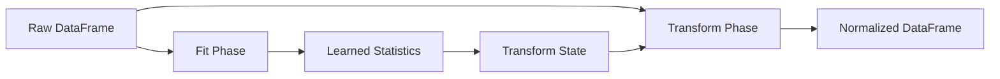

# 🏗️ Architecture: rust-ta

This document describes the high-level architecture, design philosophy, and data flow of the `rust-ta` library. It is intended for contributors and power users who need to understand the internal mechanics.

## 1. Design Philosophy

`rust-ta` is built upon four pillars:

1.  **Correctness**: Results must match reference implementations (python-ta) exactly (within floating-point epsilon).
2.  **Determinism**: Iteration order and state serialization must be reproducible across runs and architectures.
3.  **Performance**: Critical paths should be O(1) (streaming) or vectorized (batch). Memory allocations should be minimized.
4.  **Portability**: The core logic must support `no_std` environments (WASM, embedded) via feature flags.

## 2. System Overview

The library is organized as a Cargo workspace with a tiered dependency structure.



### Module Breakdown

| Crate | Responsibility | Key Abstractions |
|-------|----------------|------------------|
| **`ta-core`** | Foundational types, traits, and memory structures. | `Series`, `DataFrame`, `Bar`, `RingBuffer`, `TaFloat`, `Indicator` trait |
| **`ta-indicators`** | Financial indicator logic. | `Rsi`, `Macd`, `Ema`, `BollingerBands` |
| **`ta-transforms`** | Data pipeline and preprocessing. | `LogReturn`, `Normalization`, `TransformPipeline` |
| **`ta-simd`** | Hardware-accelerated math primitives. | (Internal usage only) |
| **`ta-python`** | FFI bindings for Python/NumPy. | `#[pymodule]` |

## 3. Core Abstractions

### 3.1. Numeric Abstraction (`TaFloat`)

To support both high-precision backtesting (`f64`) and memory-constrained environments (`f32`), all components are generic over the `TaFloat` trait.

```rust
pub trait TaFloat: Float + FromPrimitive + ToPrimitive + Copy + Send + Sync + Default + 'static {
    // Constants and helper methods
    const NAN: Self;
    fn is_valid(self) -> bool;
}
```

### 3.2. Data Structures

*   **`Series<T>`**: A contiguous heap-allocated array (`Vec<T>`) wrapper. Optimized for sequential access.
*   **`DataFrame<T>`**: A columnar store using `IndexMap<String, Series<T>>`.
    *   *Design Decision*: `IndexMap` is used instead of `HashMap` to ensure **deterministic iteration order**. This is critical for reproducing hashing states in distributed systems.
*   **`RingBuffer<T>`**: A fixed-capacity circular buffer used for sliding window calculations.
    *   *Performance*: Enables O(1) push and O(1) statistics (running sum) for simple moving averages.

### 3.3. The Indicator Trait System

The heart of the library is the `Indicator` and `StreamingIndicator` trait hierarchy.



#### Batch vs. Streaming

Every indicator implements *both* batch and streaming logic, but the architecture prioritizes streaming:

1.  **Streaming (`update`)**: Processes one `Bar` at a time. Updates internal state (e.g., `RingBuffer`, running sums) and returns the new value. **O(1)** complexity.
2.  **Batch (`calculate`)**: Iterates over the input `OhlcvSeries`, calling the logic equivalent to `update` (or a vectorized version) for every point.

## 4. State Management & Determinism

To support restarting strategies or moving calculations between nodes, all state is strictly Serializable.



### Design Rules for State:
1.  **Versioned**: Every state struct has a `version: u32` field to handle future migrations.
2.  **Self-Contained**: State must contain *everything* needed to resume calculation (including partial sums for EMAs).
3.  **Platform Independent**: Using `serde` allows transfer between Rust and Python (via Pickle or JSON).

## 5. Data Pipelines (Transforms)

The `ta-transforms` crate adopts a `fit` / `transform` pattern similar to Scikit-learn.



*   **`fit(&mut self, df)`**: Scans the data to learn global statistics (e.g., Mean, Variance, IQR). Stores these in `State`.
*   **`transform(&self, df)`**: Applies the transformation using the stored `State`. This method is immutable and thread-safe.
*   **`inverse_transform(&self, df)`**: Reverts the data to original scale (supported by Normalizers).

## 6. Implementation Details: Specific Indicators

### 6.1. Exponential Moving Average (EMA)

EMA uses a recursive formula. To ensure correctness during "warm-up":
1.  The first `window` periods use a Simple Moving Average (SMA) initialization.
2.  Subsequent periods use the EMA formula: `EMA_t = alpha * Price + (1-alpha) * EMA_{t-1}`.

### 6.2. Volatility (ATR, Bollinger)

Volatility indicators rely on a `RingBuffer` to maintain the sliding window of True Ranges or Prices.
*   **Standard Deviation**: Computed using Welford's algorithm or a two-pass algorithm on the window buffer to minimize numerical instability.

## 7. Python Bindings (PyO3)

The `ta-python` crate exposes the Rust logic as a Python module.

*   **Memory Model**: Data is passed from NumPy arrays. We attempt to use read-only views where possible, but `OhlcvSeries` construction may involve a copy to ensure memory layout guarantees (Rust expects contiguous struct-of-arrays or array-of-structs depending on internal rep, while NumPy is a pointer to data).
*   **GIL Release**: Long-running calculations (`calculate` on large arrays) release the Global Interpreter Lock (GIL) to allow multi-threaded Python execution.

## 8. Future Roadmap: SIMD

The `ta-simd` crate is reserved for explicit vectorization using the `wide` crate.

*   **Strategy**: Identify "hot loops" in `calculate` methods.
*   **Implementation**: Use `wide::f64x4` to process 4 candles per CPU cycle.
*   **Fallback**: Graceful fallback to scalar implementation if the CPU feature is missing or for `no_std` builds.
